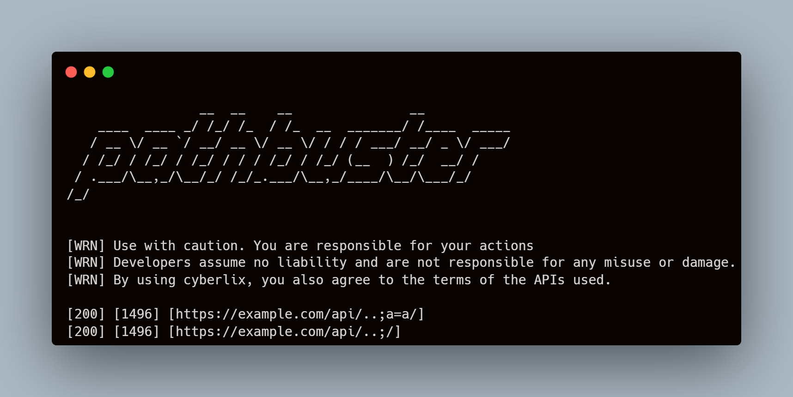

<h1 align="center">pathbuster
  <br>
</h1>

<h4 align="center">A path-normalization pentesting tool using path replacements.</h4>

<p align="center">
  <a href="/LICENSE"></a>
  <a href="http://golang.org"></a>
  <a href="https://github.com/ethicalhackingplayground/pathmbuster/issues"></a>
  <a href="https://twitter.com/z0idsec"></a>
  <a href="https://discord.gg/MQWCem5b"></a>
  <br>
</p>

---

<p align="center">
  <a href="#todos">Todos</a> •
  <a href="#installation">Installation</a> •
  <a href="#usage">Usage</a> •
  <a href="#examples">Examples</a> •
  <a href="#contributing">Contributing</a> •
  <a href="#license">License</a> •
  <a href="https://discord.gg/MQWCem5b">Join Discord</a> 
</p>

---

### Todos

- [ ] Implement multiple host scanning using the replacement `{hosts}`.
- [ ] Implement **--drop-after-fail** which will ignore requests with the same response code multiple times in a row.
---

## Installation

Install rust

```bash
curl --proto '=https' --tlsv1.2 -sSf https://sh.rustup.rs | sh
```

Install pathbuster

```bash
cargo add pathbuster
```


## Usage

```bash
pathbuster -h
```

<details>
<summary> 👉 pathbuster help menu 👈</summary>

```
USAGE:
    pathbuster [OPTIONS] --url <url> --payloads <payloads> --paths <paths> --deviation <deviation>

OPTIONS:
    -c, --concurrency <concurrency>
            The amount of concurrent requests [default: 100]

        --deviation <deviation>
            The distance between the responses [default: 3]

    -h, --help
            Print help information

        --match-status <match-status>
            [default: 200]

    -o, --out <out>
            The output file

    -p, --payloads <payloads>
            the file containing the traversal payloads [default: ]

        --paths <paths>
            The list of routes (crawl the host to collect routes) [default: .paths.tmp]

    -r, --rate <rate>
            Maximum in-flight requests per second [default: 1000]

        --stop-at-first-match <stop-at-first-match>
            stops execution flow on the first match [default: false]

    -u, --url <url>
            the url you would like to test

    -V, --version
            Print version information

    -w, --workers <workers>
            The amount of workers [default: 1]

        --wordlist <wordlist>
            the file containing the technology paths [default: .wordlist.tmp]
```

</details>

## Examples

Fingerprinting the proxy

```rust
$ pathbuster -u "https://example.com/{paths}/{payloads}" --payloads traversals.txt --paths paths.txt --match-status 400 --deviation 2 -o output.txt
```

Discovery Process

```rust
$ pathbuster -u "https://example.com/{paths}/{payloads}/{words}" --payloads traversals.txt --paths paths.txt --wordlist raft-medium-directories.txt --match-status 200 --deviation 2 -o output.txt
```




## Contributing

Pull requests are welcome. For major changes, please open an issue first
to discuss what you would like to change.

Please make sure to update tests as appropriate.

## License

Pathbuster is distributed under [MIT License](https://github.com/ethicalhackingplayground/pathbuster/blob/main/LICENSE)